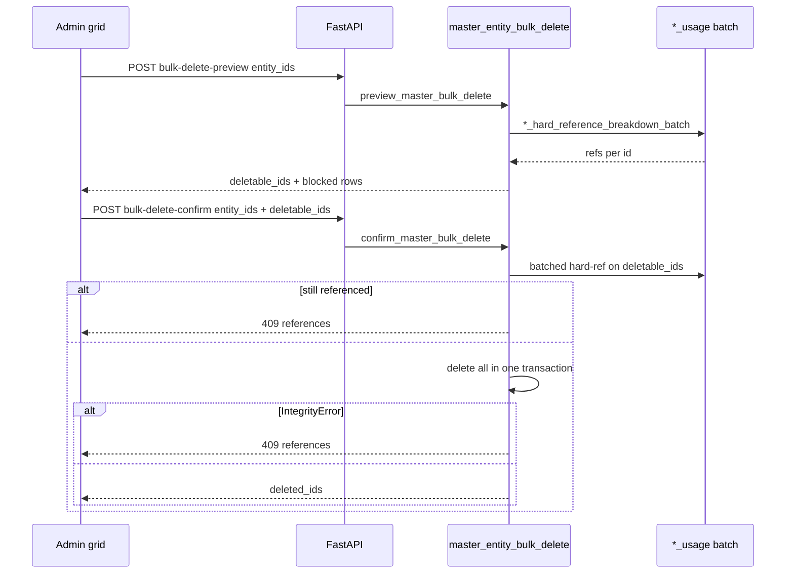

# Master entity bulk delete — architecture and handoff

## Problem (May 2026)

Bulk delete preview was slow (~N×15 queries per id) and confirm could return **500** when `customer_usage` missed FK blockers (e.g. `import_distributor_si_staging_line.resolved_customer_id`). Confirm also re-ran full preview, doubling latency.

## Solution summary

| Layer | Change |
|-------|--------|
| **Reference checks** | Complete FK coverage per dimension + batched `GROUP BY` preview |
| **Confirm API** | Optional `deletable_ids` skips re-preview; batched hard-ref recheck only |
| **Transactions** | All-or-nothing batch; `IntegrityError` → structured **409** with `references` |
| **Web** | Confirm sends `deletable_ids`; dialog shows 409 reference detail (not generic 500) |

## API contract

### Preview

`POST /api/v1/{customers|products|distributors}/bulk-delete-preview`  
`POST /api/v1/catalog/{channels|regions}/bulk-delete-preview`

```json
{ "entity_ids": [1, 2, 3] }
```

Response: `entity_ids`, `rows[]` (`id`, `label`, `references`, `blocked`), `deletable_ids`, counts. Max **200** ids.

### Confirm

Same path prefix with `bulk-delete-confirm`.

```json
{
  "entity_ids": [1, 2, 3],
  "deletable_ids": [1],
  "preview_token": null
}
```

- **`deletable_ids` (recommended):** subset from preview; confirm skips full preview, runs batched hard-ref check on these ids only, then deletes.
- **Backward compat:** omit `deletable_ids` → one preview + delete deletable rows (skipped blocked still reported).
- **409:** `detail.message` + `detail.references` (`{label, count}[]`) — same shape as single-row `DELETE`.
- **Errors:** `not_all_entities_found`, `entities_still_blocked`, `deletable_ids_not_subset`.

## Flow



## Files

| File | Role |
|------|------|
| `apps/api/app/services/master_usage_batch.py` | Shared `batch_counts_for_column` |
| `apps/api/app/services/customer_usage.py` | Customer FK labels + batch breakdown |
| `apps/api/app/services/product_usage.py` | Product FK labels + batch breakdown |
| `apps/api/app/services/distributor_usage.py` | Distributor FK labels + batch breakdown |
| `apps/api/app/services/channel_usage.py` | Channel FK labels + batch breakdown |
| `apps/api/app/services/region_usage.py` | Region FK labels + batch breakdown |
| `apps/api/app/services/master_entity_bulk_delete.py` | Preview/confirm orchestration |
| `apps/api/app/api/v1/master_bulk_delete_http.py` | ValueError / Integrity → HTTPException |
| `apps/api/app/api/v1/endpoints/{customers,products,distributors,catalog}.py` | Routes |
| `apps/web/src/components/bulkTable/MasterBulkDeleteImpactDialog.tsx` | Preview UI + 409 display |
| `apps/web/src/lib/api.ts` | `apiPost` throws `HttpConflictError` on 409 |

## Customer hard refs (representative)

Includes facts, commercial planner, lineup, shipment evidence, **DSI staging** (`resolved_customer_id`), **customer sell-through staging**, **customer source token aliases**, **import mapping candidates** (`customer_dealer_token`, `shipment_customer_token`), budget requests (`linked_customer_id`), OPEN_CHANNEL system block.

## Tests

```bash
cd apps/api
ALLOW_TESTS_ON_DEV_DB=1 pytest tests/test_master_entity_bulk_delete.py \
  tests/test_customers_delete.py \
  tests/test_customer_usage_lineup_refs.py \
  tests/test_customer_bulk_delete_staging_block.py -q

cd ../..
pnpm --filter @cip/web test MasterBulkDeleteImpactDialog.test.tsx
```

## Known limits

- No `preview_token` HMAC yet (field reserved); trust `deletable_ids` + confirm-time batched recheck.
- Mapping candidate `suggested_entity_id` is not a DB FK; blocked by explicit entity_type filters.
- `FactSalesSellin` has no `customer_id` (distributor/product only) — not a customer blocker.
- Max 200 ids per request (`MAX_BULK_IDS`).

## DSI / steward

Does **not** change DSI resolution, eligibility, or steward auto-create rules. Only delete-time reference detection and bulk orchestration.
