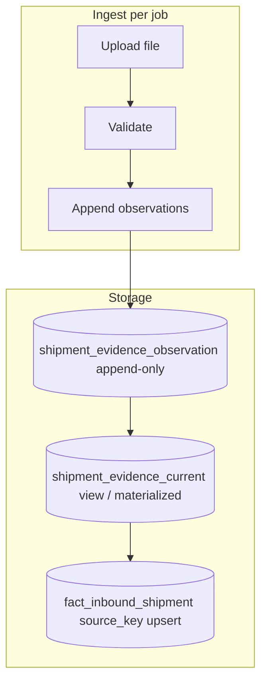

# Plan D — Bitemporal shipment evidence (BACKLOG-033 design)

**Status:** D1–D3 **done** on `cip` (2026-07-02). D4–D5 deferred (BACKLOG-057/058). Change-event derivation v1 shipped (phase 4).  
**Backlog:** BACKLOG-033 **closed** — see BACKLOG-057/058 for legacy column deprecation.  
**Trigger:** ~~Weekly shipment cadence~~ **fired** — cutover complete.

## Problem

Today:

- `shipment_evidence_line` is **per job** (good history) but line identity can shift on re-import.
- `fact_inbound_shipment` is **global `source_key` latest-job-wins** (good operational truth) but loses observation history.
- DSI corroboration reads **evidence**, not fact — correct for explainability, but operators confuse upload vs apply.

Plan C adds steward/plan parity and operator docs; Plan D addresses **schema-level** evidence lifecycle.

## Target model

### 1. Append-only observations

New table (conceptual) `shipment_evidence_observation`:

- Stable `observation_id` (surrogate)
- `line_identity_key` — business-stable key derived from order/line/delivery dimensions (same family as `source_key` but evidence-scoped)
- `import_job_id`, `observed_at`, `valid_from` (transaction time)
- Raw + normalized attributes (qty, dates, tokens, resolution FKs at observation time)
- **Never UPDATE** observation rows; corrections = new observation + optional supersession link

### 2. Current-state view

`shipment_evidence_current` (view or table maintained on apply):

- One row per `line_identity_key` (or per `source_key` where 1:1)
- Points to **latest** observation per business rules (job apply order, not upload order)
- Steward UI lists candidates from **current job evidence**; corroboration can union observations across jobs

### 3. Fact layer unchanged in semantics

`fact_inbound_shipment` remains latest-job-wins on `source_key`. Apply path:

1. Read **steward-resolved current evidence** for job
2. Upsert fact rows
3. Emit audit: which observation_ids contributed

## Consumer migration

| Consumer | Today | Plan D change |
|----------|-------|----------------|
| `dsi_product_shipment_tiebreak` / corroboration | Reads `shipment_evidence_line` per job | Read observations filtered by distributor/product/date; prefer current view for performance |
| `dsi_soh_reconciliation` | Shipment fact + DSI sell-out | Optional observation timestamps for landed vs in-transit |
| Shipping summary / admin grid | `shipment_evidence_line` | Paginate `shipment_evidence_current` + drill-down to observations |
| Steward mapping candidates | `ImportEntityMappingCandidate` per job | Unchanged job scope; enrichment may scan observation history |

## Migration phases (when approved)

1. **D1 — Schema:** ✅ `20260628_0059` observation table + `20260702_0066` current-state view + grants.
2. **D2 — Dual-write:** ✅ Default ON (`CIP_SHIPMENT_BITEMPORAL_DUAL_WRITE`); validate appends observations idempotently per `(import_job_id, source_row_hash)`.
3. **D3 — Read switch:** ✅ Default ON (`CIP_SHIPMENT_BITEMPORAL_READ`); all inventoried consumers read `shipment_evidence_current`; legacy dupes soft-superseded via `corpus_superseded_at` (35,134 rows on cip).
4. **D4 — Deprecate:** Stop writing `shipment_evidence_line` columns that duplicate observation payload; keep job-scoped staging for candidate generation. → **BACKLOG-057**
5. **D5 — Cleanup:** Drop redundant columns after soak. → **BACKLOG-058**

## Identity addendum (2026-07-02)

State-aware `line_identity_key`:

- **Shipped** corpus grain: `ship:{OU|delivery_no|item_code|purchase_order_id|invoice_line}` — matches audit 5b invoice-line identity; PO required (digest fallback when missing).
- **Open-order** grain unchanged: `order:{OU|order_no|order_line|item}`.
- Sheet name / `report_type` casing normalized in `source_key` generation (`Shipped` ≡ `shipped`).

`shipment_evidence_current` view: `DISTINCT ON (line_identity_key)` latest observation; resolution columns COALESCE from live evidence line via `evidence_line_id`.

## Change events v1 (phase 4)

Derived-on-read from observation chains (no fact table): `date_slip`, `qty_change`, `graduated` (order-grain open→shipped lineage), `pod_reversal` (POD cleared — steward flag, does not un-graduate). API: `GET /shipment-evidence/change-events`; CLI: `scripts/ops/run_shipment_change_events.py`. Cancelled-candidate via report-coverage → v2 (not built).

## Out of scope

- Changing DSI resolution tier order or eligibility
- Auto-create masters from evidence
- ETA ML / prediction models (separate backlog)

## Risks

- `source_key` vs `line_identity_key` drift — must document canonical derivation (same as today’s shipment key builder).
- Storage growth — partition observations by `import_job_id` or month.
- Apply idempotency — observation append must be idempotent per `(import_job_id, source_row_hash)` to allow safe re-validate.

## Relation to Plan C

Plan C ships steward workspace + resolution plan + paginated APIs on **existing** tables. Plan D cutover (D1–D3 + change events v1) shipped 2026-07-02; BACKLOG-033 closed.
