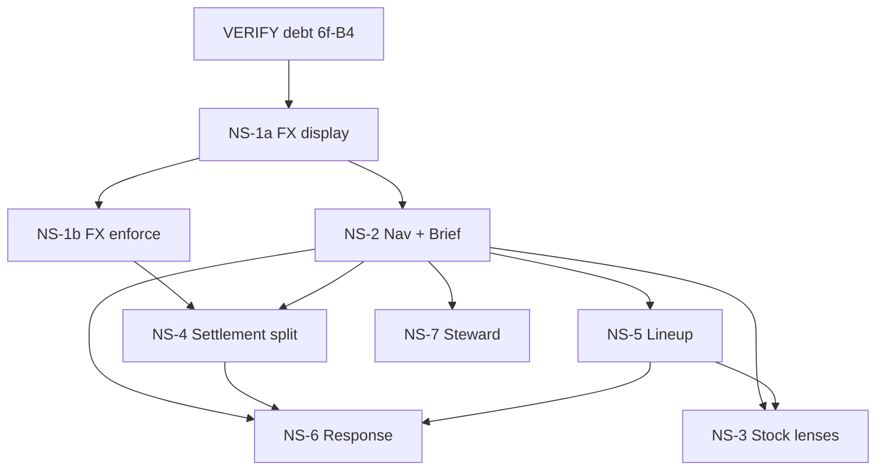

# North Star implementation plan — six job containers

**Date:** 2026-08-30  
**Status:** PLANNING — no product source in this document  

## Branch prerequisite (exact state — 2026-08-30)

| Question | Answer |
|---|---|
| Is `design-language-v1` merged to `main`? | **Yes.** Fast-forward to `83b4290` on `main` (`0ed0d37` with CONTEXT promotion line). |
| Is charter v1.3 on `main`? | **Yes.** `docs/AUTONOMOUS_BUILD_CHARTER.md` v1.3 — amendments 1–7 applied (`docs/design/CHARTER_AMENDMENTS.md` APPLIED). |
| Frozen design language on `main`? | **Yes.** `docs/design/CIP_DESIGN_LANGUAGE.md` FROZEN v1.1, nav map, mockups, `PACKET_DATA.md`, `SPEC_GAPS.md` GAP-001–015 resolved. |

**Gate:** Met — NS-1a may start when Warren approves.

**This plan branch:** Rebased onto `main` `0ed0d37` after promotion.

**Governing inputs (required on `main` before NS-1a):**

| Document | Version / state |
|---|---|
| `docs/design/CIP_DESIGN_LANGUAGE.md` | FROZEN v1.1 — six grammars |
| `docs/design/CIP_NAV_MAP.md` | v1 — six containers + utilities |
| `docs/design/NAV_COVERAGE.md` | 47/47 routes mapped |
| `docs/design/PACKET_DATA.md` | Canonical mockup figures |
| `docs/AUTONOMOUS_BUILD_CHARTER.md` | v1.3 — amendments 1–7 applied |
| `docs/design/CHARTER_AMENDMENTS.md` | APPLIED |

**Out of scope for this phase:** Reports (grammar 6), Admin utilities beyond spine placement,
`/market` parked stub.

**Sequencing principle:** create-path-before-consolidation — ship the new container route and
grammar **before** retiring absorbed routes; keep redirects until the replacement surface is
VERIFY-passed. Extract shared shell components (spine, filter bar, Read strip) once in NS-2;
reuse in NS-3–NS-7 — do not fork per container.

---

## Item 0 — VERIFY debt (blocks `main` promotion, not next unit)

Charter v1.3 amendment 7. Full register in `docs/BACKLOG.md` § VERIFY-debt register.

| Unit | Shipped | VERIFY would check | Evidence to close |
|---|---|---|---|
| **6f** | 2026-08-08 · PR #18 / D-040 | D-040 propose→confirm attribution: `distributor_attribution_status` transitions; Accept ship-corroborated; soft-clear; confirmer exact-qty Phase-1; no auto-clear on conflict | Browser smoke: case **1016** Proposed state → Accept → confirmed; `steward_audit_event` rows; no auto-clear on conflict tokens; pytest `test_d040_*` green |
| **7** | 2026-08-12 · BACKLOG-068 | Shipping lineup-quarter strip: `landed_this_quarter_units` (`pod_date` quarter) + `shipped_not_landed_units`; PvE fill rate untouched; strip labels match semantics | Browser: `/shipping` strip labels vs `COMMERCIAL_SEMANTICS.md`; API spot-check one PO group; PvE fill % unchanged |
| **8** | 2026-08-12 · Demo/P2 gate | Second-user login → landing → Shipping unaided; Users RBAC default-deny; backup→`cip_alembic_smoke` `RESTORE_SMOKE_OK`; `docs/UNIT8_DEMO_P2_GATE.md` steps | Re-run A1–A8 + B1–B4 on current HEAD; update gate doc dates; `VERDICT: PASS` or Warren waiver in CURRENT |
| **11** | 2026-08-12 · import parity | BACKLOG-044/027 steward/import parity vs DSI/shipment: async apply+progress, shared steward engine slots, contract S-rows on shipped tree | CONSULT enumerates S1–S14 per importer row in `IMPORT_FLOW_CAPABILITY_CONTRACT.md`; browser steward smoke per shipped importer; no thin mounts |
| **12** | 2026-08-12 · P6 polish | BACKLOG-026 PM pipeline retired; Settings lineup export sheet titles; no regression to import parity from Unit 11 | `pnpm test:web` + PM apply path smoke; export sheet title spot-check; VERIFY S-rows from Unit 11 still pass |
| **15B** | 2026-08-14 · B1 forecast | `/forecasts` compute-from-history; `tenant_id` never NULL; velocity + analogue provenance; B1-07 semantics; paste/add remain overrides only | Browser `/forecasts` compute; DB `tenant_id` NOT NULL on new rows; provenance JSON on forecast lines |
| **B4 (15C)** | 2026-08-14 · promo planner | Per-line `build_promo_plan_draft`; dirty MAC/units survive Refresh; create-case `lines[]` (`manual` vs `intake_weighted`); D-051–D056 column-mapped export; BACKLOG-094 closed criteria | Browser promo planner dirty-state refresh; create-case payload inspection; export column map vs D-051–D056 |

**Recommendation:** Run VERIFY debt as a **parallel hygiene track** before or alongside NS-1a;
do not start NS container redesign until Warren accepts VERIFY backlog or waives rows in
CURRENT.

---

## Unit NS-1a — FX display honesty (no migration)

**Goal:** Settlement money surfaces never silent-convert FX in **display**; readiness chips
reflect real case state using **existing columns only** (`roe_snapshot`, `currency_code`,
`missing_roe`, `currency_mismatch` flags). No schema change. Brief/Settlement Reads can cite
FX-blocked counts from null-ROE and mismatch flags.

**Grammar / container:** Grammar 1 · **Settlement** (readiness + blocked **display** on
existing routes — not full queue+case redesign; that is NS-4).

**Depends on:** `design-language-v1` merged to `main`; plan branch rebased.

### Routes (`NAV_COVERAGE.md`)

| Route | Role in unit |
|---|---|
| `/commercial-planner/cpor-cases` | Book list: `blocked` badge, `missing_roe` / `currency_mismatch` flags visible |
| `/commercial-planner/cpor-cases/[id]` | Case pane: readiness row FX chip from `roe_snapshot` / flags |
| `/commercial-planner/cpor-cases/payment-evidence-import` | Surface `currency_mismatch` when evidence ccy ≠ case ccy |
| `/budgets`, `/budget-requests` | Context only — regime figures must not aggregate across flagged cases |

### API changes

| Area | Change |
|---|---|
| `cpor_cases.py` read models | Expose `fx_blocked` (derived: null `roe_snapshot` and/or `currency_mismatch`), `roe_snapshot`, `missing_roe`, `currency_mismatch` on list + detail — **no `fx_mode`** |
| `payment_recon.py` | Ensure book aggregations respect `currency_mismatch` flags (no silent ZAR sum of mixed ccy) |
| `waterfall.py` / `pivot.py` | Propagate `missing_roe` to book-level blocked count |

**Readers that must migrate with any new writer:** `GET /cpor/cases`, `GET /cpor/cases/{id}`,
payment recon read model, portfolio intelligence panel, export xlsx pivot, Brief signal
feeder (NS-2).

### Web changes

| Area | Change |
|---|---|
| `cpor-cases/page.tsx` | Inline `blocked` / `FX undeclared` badges; book shape segment for blocked (hatched) |
| `cpor-cases/[id]` | Readiness row: `FX declared · {rate}` pass / `FX undeclared` fail from `roe_snapshot` |
| Payment recon columns | Show `paid_other_currency` aside — never fold into outstanding |
| All money columns | **USD never rendered as ZAR** — label currency explicitly; dim wrong-currency cells |

### Migration required?

**No.**

### Contract rows (pre-build)

| ID | Row |
|---|---|
| C-NS1a-01 | Grammar 1 · Settlement · blocked state (FX undeclared) per `CIP_DESIGN_LANGUAGE.md` §6 |
| C-NS1a-02 | Readiness row FX chip reflects `roe_snapshot` / flags — no invented state |
| C-NS1a-03 | No silent currency conversion in display — `currency_mismatch` visible; `COMMERCIAL_DOMAIN_RULES.md` §1.4 |
| C-NS1a-04 | Book aggregation sums per-case ZAR only (`COMMERCIAL_SEMANTICS.md` currency rule) |
| C-NS1a-05 | USD amounts never labelled or formatted as ZAR (browser-verifiable) |

### VERIFY / test evidence

- Pytest: `payment_recon` mixed-currency case → `currency_mismatch` flag; book total excludes `paid_other`
- **Browser (done-bar):** case list + detail — USD line/case amounts show USD; ZAR show ZAR; no column presents USD figure with ZAR symbol/label
- **Browser (done-bar):** readiness chips match case state (null `roe_snapshot` → fail chip; declared rate → pass chip)
- SQL: real row through recon on dev `cip` (project SQL rule)

### Done state

- Zero silent FX convert paths in settlement **read/display/aggregate** chain
- Blocked cases countable for Brief signal (feeds NS-2)
- No migration; no settle **enforcement** (that is NS-1b)

### Risks and gates

| Gate | Constraint |
|---|---|
| `COMMERCIAL_DOMAIN_RULES.md` §1.4 | USD compute; ZAR display per-case FX |
| No auto-create | FX display does not auto-create master dims |
| DB safety | No migration in this unit |
| Create-path-before-consolidation | Ship on **existing** CPOR routes before NS-4 replaces chrome |

**Destructive paths:** None.

---

## Unit NS-1b — FX mode + blocked-settle enforcement (migration gate)

**Goal:** Booked vs floating FX modes per domain §1.5 on the case; API **refuses settle** when
FX is undeclared or blocked per enforced rules; settle preview prints FX basis.

**Grammar / container:** Grammar 1 · **Settlement** (write enforcement).

**Depends on:** NS-1a VERIFY PASS.

### Routes

Same routes as NS-1a; enforcement applies on settle transition and case patch (`roe_snapshot`,
`fx_mode`).

### API changes

| Area | Change |
|---|---|
| `cpor_case` schema | `fx_mode` (`booked` \| `floating`); optional `fx_declared_at` / `fx_declared_by` |
| Settle transition | Refuse settle when `fx_blocked` / missing declared FX per enforced rules |
| Case patch | Persist `fx_mode` + `roe_snapshot` with audit |

**Readers that must migrate:** All NS-1a readers plus settle/preview endpoints, NS-4 settle flow.

### Web changes

| Area | Change |
|---|---|
| Case detail | `fx_mode` selector (booked / floating) when declaring FX |
| Settle action | Disabled until readiness pass; preview shows FX basis line (`settlement-confirm.html`) |

### Migration required?

**YES — own gate.** Warren explicit approval before `alembic revision`; `alembic current`
before generate; `current_database() = 'cip'` verified. **Clone-proof:** settle attempt on
disposable DB with null-ROE case → 409; declared case → preview succeeds.

### Contract rows (pre-build)

| ID | Row |
|---|---|
| C-NS1b-01 | `fx_mode` booked vs floating per `COMMERCIAL_DOMAIN_RULES.md` §1.5 |
| C-NS1b-02 | Settle endpoint refuses blocked FX (409 or equivalent) |
| C-NS1b-03 | Settle preview prints FX basis line |
| C-NS1b-04 | Migration reversible plan documented before apply |

### VERIFY / test evidence

- Pytest: settle endpoint 409 when `roe_snapshot` null / FX blocked
- Browser: declare FX + mode → readiness pass → preview settle → confirm
- Clone-proof settle on disposable DB before prod

### Done state

- `fx_mode` column live; blocked-settle enforced in API
- NS-4 may ship full settle UX (depends on NS-1b for enforcement)

### Risks and gates

| Gate | Constraint |
|---|---|
| Migration approval | Warren gate — separate PR from NS-1a |
| Clone-proof | Settle enforcement proven on clone before `cip` |
| NS-1a | Display honesty must be live first |

**Destructive paths:** Settle on blocked case — prevented by enforcement; clone-proof required.

---

## Unit NS-2 — Nav collapse to six containers + Brief

**Goal:** Spine matches `CIP_NAV_MAP.md` (Brief · Lineup · Stock · Settlement · Response ·
Steward · Reports · Admin); Brief (grammar 3) replaces Dashboard/Control tower as landing;
retired routes redirect, not 404.

**Grammar / container:** Grammar 3 · **Brief** + shell spine (all grammars inherit spine).

### Routes

| Route | Disposition |
|---|---|
| `/` | Redirect → `/brief` (or `/dashboard` → `/brief` until cutover) |
| `/brief` | **NEW** — signal blotter (or repurpose `/dashboard`) |
| `/dashboard`, `/exceptions`, `/getting-started` | Retired → redirect to `/brief` with fragment/deep-link map |
| All container routes | Spine nav only — collapse `navConfig.ts` groups into six containers |
| `/reports`, `/dashboards`, `/inbox` | Utilities — remain, demoted below rule |
| `/admin/*` settings ops | Utilities Admin — unchanged scope |

### API changes

| Endpoint | Purpose |
|---|---|
| `GET /brief/signals` (new) | Federated signal rows: failed imports, stale DSI, cover breaches, FX-blocked cases (NS-1a), recon-not-run, missing assumptions |
| Existing freshness | Reuse import-job freshness for signal provenance |

**Readers migrating:** All pages using `navConfig.ts`, `AppShell`, login redirect target,
`UNIT8_DEMO_P2_GATE.md` (update landing from Control tower → Brief).

### Web changes

| Area | Change |
|---|---|
| `navConfig.ts` | Six primary containers + utilities; mono badge counts per `PACKET_DATA.md` / live counts |
| `features/shell/` | Spine 190px, util nav, session block per `CIP_DESIGN_LANGUAGE.md` §3 |
| `brief/page.tsx` | Grammar 3: Read + ranked signal rows; **no filter bar**; no KPI cards |
| Redirects | `next.config` or middleware for retired paths |

### Migration required?

**No.**

### Contract rows

| ID | Row |
|---|---|
| C-NS2-01 | Grammar 3 · Brief · signal blotter; no KPI-card landing |
| C-NS2-02 | Spine labels per `NAMING.md`; badge = on-surface row count |
| C-NS2-03 | Brief Read federated — every figure traces to a signal row |
| C-NS2-04 | Full shell on state frames (`brief-empty.html`) |
| C-NS2-05 | Manager reaches any container unaided (charter P2-4 exit) |

### VERIFY / test evidence

- Browser: login → Brief; spine six containers; badge counts match grid/signal rows
- Browser: viewer role reaches Stock lens redirect target unaided (Unit 8 A5/A6 updated)
- `navConfig` unit tests: role gating preserved
- No `/dashboard` KPI cards remain

### Done state

- `NAV_COVERAGE.md` UNMAPPED still 0; `/brief` mapped to §1
- `UNIT8_DEMO_P2_GATE.md` landing checklist updated to Brief
- Shared shell components extracted for NS-3–NS-7

### Risks and gates

| Gate | Constraint |
|---|---|
| Create-path-before-consolidation | `/brief` live **before** removing `/dashboard` content |
| P2-4 charter | Brief grammar 3 exit — not control tower |
| RBAC | `navConfig` role gates unchanged (BACKLOG-141 shipment panel separate) |
| Brief signals | FX-blocked signal requires NS-1a; others may ship `data_unavailable` until backends ready |

**Destructive paths:** None.

**Sequencing note:** NS-2 **after** NS-1a so Brief can cite real FX-blocked counts (display
flags only — settle enforcement is NS-1b).

---

## Unit NS-3 — Stock merge (Channel Ops + PvE + shipping → lenses)

**Goal:** One **Stock** container (grammar 2) with lens switcher: Sell-out · Fill vs plan ·
Cover · Inbound; absorbs `/sell-out`, `/plan-vs-executed`, `/shipping`, `/channel-intelligence`,
`/forecasts` as lenses/context chips.

**Grammar / container:** Grammar 2 · **Stock**.

### Routes

| Current route | Target disposition |
|---|---|
| `/stock` | **NEW** container (or `/sell-out` repurposed as default lens) |
| `/sell-out` | Lens: Movement (Sell-out) — redirect to `/stock?lens=movement` |
| `/plan-vs-executed` | Lens: Fill vs plan (Execution) |
| `/shipping`, `/admin/po-management` | Lens: Inbound |
| `/channel-intelligence` | Context chip (CST velocity) on Movement/Cover |
| `/forecasts` | Context chip (demand input) — not a lens |
| `/inventory` | Retired — redirect with directive copy |

### API changes

| Area | Change |
|---|---|
| Stock book read model | Unified `from`/`to`/`bu` filter params across lenses |
| Cover | WOC histogram + under-4w pairs (`stock-cover.html`) |
| Movement | Sell-out grid — existing DSI/CST endpoints |
| Execution | Plan vs Executed — existing `plan_vs_executed.py`; preserve `fx_partial` honesty |
| Inbound | Shipment/PO grid — `landed_this_quarter_units` / `shipped_not_landed_units` (Unit 7) |
| Regime strip | Lens-scoped: Cover = under-4w pairs; Inbound = pipeline fill % / not received |

**Readers migrating:** `PlanVsExecutedView`, `PoManagementView`, sell-out pages, shipping
strip components, channel-intelligence summaries.

### Web changes

| Area | Change |
|---|---|
| `features/stock/` | New container; lens switcher = instrument control |
| Filter bar | Sticky From/To/BU + saved view — all lenses |
| Per-lens instrument | Cover = histogram; others = weekly trend per SPEC_GAPS GAP-002 |
| Book-level blocked badge | SOH recon stale / DSI vintage stale on Read line |

### Migration required?

**No** for UI shell. Possible **read-model-only** API additions (aggregated regime counts) —
no schema.

### Contract rows

| ID | Row |
|---|---|
| C-NS3-01 | Grammar 2 · Stock · lens switcher labels (Sell-out · Fill vs plan · Cover · Inbound) |
| C-NS3-02 | Filter bar invariant + drill additive fields |
| C-NS3-03 | Fill vs plan vs Pipeline fill % naming |
| C-NS3-04 | Not received grain = open lines (`PACKET_DATA.md`) |
| C-NS3-05 | Book-level blocked/stale on Read (`GAP-003`) |
| C-NS3-06 | `fx_partial` surfaced on Execution lens — no silent full conversion |

### VERIFY / test evidence

- Browser: each lens loads; filter bar persists across lens switch
- Browser: Inbound strip semantics match Unit 7 VERIFY
- Browser: Cover histogram + empty/loading frames (`stock-cover-*.html`)
- Pytest: plan-vs-executed `fx_partial` unchanged

### Done state

- Single Stock entry in spine; legacy routes redirect
- `BACKLOG-090`, `BACKLOG-091` absorbed or closed
- Channel Ops duplicate nav entries removed

### Risks and gates

| Gate | Constraint |
|---|---|
| `COMMERCIAL_DOMAIN_RULES.md` §1.2–1.3 | Landed vs shipped axes — do not conflate fill rate and budget quarter |
| `COMMERCIAL_SEMANTICS.md` | SOH derived; reported SOH recon only |
| Create-path-before-consolidation | `/stock` lenses live before dropping `/sell-out` nav entries |
| BACKLOG-097 | Materialised aggregates — defer unless perf TRIGGER fires |

**Destructive paths:** None.

**Sequencing note:** Large unit — may split into NS-3a (Inbound + redirects) and NS-3b
(Cover + Movement) if VERIFY budget exceeded.

---

## Unit NS-4 — Settlement split (queue + case)

**Goal:** Full grammar 1 queue+case 56/44 split per `funding-settlement-r3.html`; book Read +
shape bars + concentration; case record pane with anchor panel, readiness, preview-confirm settle.

**Grammar / container:** Grammar 1 · **Settlement**.

### Routes

| Route | Change |
|---|---|
| `/commercial-planner/cpor-cases` | Queue pane redesign |
| `/commercial-planner/cpor-cases/[id]` | Case pane in-place (no teleport) |
| `/commercial-planner/cpor-cases/historical-import` | Evidence ingest — grammar 5 entry from case |
| `/commercial-planner/cpor-cases/payment-evidence-import` | Evidence ingest |
| `/budgets`, `/budget-requests` | Context strips on book |

### API changes

| Area | Change |
|---|---|
| Book read model | Shape segments: settled / outstanding / blocked; regime figures + weekly Δ |
| Case detail | Lines/Evidence/Assumptions/Activity tabs with counts |
| Settle flow | Preview payload with printed amounts; readiness checks |
| Payment recon | Owed/paid/outstanding columns canonical (Unit 13 baseline) |

**Readers migrating:** All CPOR list/detail consumers, `CporPortfolioIntelligencePanel`, promo
export paths, Brief settlement signal.

### Web changes

| Area | Change |
|---|---|
| `features/settlement/` | Extract from `cpor-cases/*` — queue+case split layout |
| Grid | 36px rows; settled rows recede; Δ-week column |
| `settlement-confirm.html` | Preview-confirm dialog pattern |

### Migration required?

**No** for layout/chrome. **Settle enforcement** requires NS-1b VERIFY PASS before preview-confirm
settle ships in this unit.

### Dependencies

| Dependency | Required for |
|---|---|
| NS-1a | Blocked FX display, readiness chips, hatched shape segments |
| NS-1b | Settle preview-confirm **enforcement** (API refuse + `fx_mode`) |

### Contract rows

| ID | Row |
|---|---|
| C-NS4-01 | Grammar 1 · Settlement · queue+case 56/44 |
| C-NS4-02 | Book Read + shape bar + concentration list |
| C-NS4-03 | Case anchor panel + dominant money figure (one per screen) |
| C-NS4-04 | Readiness row before settle; preview-confirm |
| C-NS4-05 | Primary button includes amount ("Record settlement · R …") |
| C-NS4-06 | Steward S-rows **not** required — settlement is not import steward |

### VERIFY / test evidence

- Browser: queue selection persists; case opens in place
- Browser: blocked FX case (NS-1a) shows hatched shape segment
- Browser: settle preview → confirm → book counts tick down (**requires NS-1b**)
- Fable batch audit vs `funding-settlement-r3.html`

### Done state

- CPOR list matches grammar 1 exemplar
- `CporPortfolioIntelligencePanel` retired or folded into book Read
- Historical/payment import reachable from case context

### Risks and gates

| Gate | Constraint |
|---|---|
| NS-1a dependency | FX display honesty live before book shape segments |
| NS-1b dependency | Blocked-settle enforcement before preview-confirm settle ships |
| `CPOR_SETTLEMENT_SPEC.md` | Hops 2/5/6/10 system-assisted; 3/4/7/8/9/11 human |
| BACKLOG-136 | CPOR RBAC — coordinate; do not ship null actors on new writes |
| BACKLOG-095 | Reapproval ceiling — readiness chip |
| Clone-proof | Settle on disposable case clone before prod proof |

**Destructive paths:** Settle action — idempotent preview-confirm; clone-proof first.

---

## Unit NS-5 — Lineup

**Goal:** Lineup as plan origination (grammar 2): pending Approve/Reject, inline Planned edit,
plan action bar (Calc · Export · Apply); net requirement via `/buy-plans`.

**Grammar / container:** Grammar 2 · **Lineup**.

### Routes

| Route | Role |
|---|---|
| `/lineup` | Plan composition + items grid |
| `/buy-plans` | Net requirement (B2) |
| `/commercial-planner` | Retire Lineup coverage tab → redirect `/lineup` |

### API changes

| Area | Change |
|---|---|
| Lineup read model | Pending vs decided rows; approval badges |
| Net requirement | B2 calc endpoint unchanged semantics |
| Export / apply | Async apply + progress (existing parity bar) |

**Readers migrating:** `commercial-planner/page.tsx` lineup sections, buy-plans page, lineup
import job views (ingest remains Steward).

### Web changes

| Area | Change |
|---|---|
| `features/lineup/` | `lineup.html` / `lineup-pending.html` fidelity |
| Plan action bar | Net requirement summary + Calc · Export · Apply |
| Row actions | Approve/Reject on pending only |

### Migration required?

**No.**

### Contract rows

| ID | Row |
|---|---|
| C-NS5-01 | Grammar 2 · Lineup · plan origination affordances (`GAP-013`) |
| C-NS5-02 | Half-year → Q1+Q2 split (domain rule) |
| C-NS5-03 | Lineup does not edit from Stock/Response (boundary) |
| C-NS5-04 | Import ingest remains Steward — file jobs not on Lineup surface |

### VERIFY / test evidence

- Browser: pending row Approve/Reject; decided row no actions
- Browser: plan action bar Calc → Export path
- Import parity: lineup apply async + progress unchanged

### Done state

- `/lineup` matches mockup; commercial-planner lineup tab retired
- Stock Execution lens reads plan without editing

### Risks and gates

| Gate | Constraint |
|---|---|
| DSI/eligibility | Do not touch resolution order |
| Supersession | BACKLOG-118 carry `commercial_lineup_case_po` on supersede |
| Create-path-before-consolidation | `/lineup` redesign live before removing CP tab |
| AMBER | Economics/trust flags — Warren sign-off on Reads |

**Destructive paths:** Lineup apply / supersession — existing clone-proof discipline.

---

## Unit NS-6 — Response

**Goal:** Ranked commercial actions (grammar 4); calculators as evidence-backed tools; do-nothing
recorded; promo compose → creates Settlement case.

**Grammar / container:** Grammar 4 · **Response**.

### Routes

| Route | Disposition |
|---|---|
| `/response` | **NEW** container |
| `/commercial-planner` | Retire Plans & lines → `/response` |
| `/pricing`, `/competition` | Absorb as calculator/evidence panels |
| `/promotions` | Retired — redirect |
| `/roadmap` | Context notes |

### API changes

| Area | Change |
|---|---|
| Action ranking read model | Ranked list with suggested action (one per surface) |
| Promo calculator | `build_promo_plan_draft` → create-case `lines[]` (B4) |
| Buy/cover math | Read-only calculators — "does not write a PO" |

**Readers migrating:** Commercial planner plans panel, promotions scaffold, pricing/competition
pages.

### Web changes

| Area | Change |
|---|---|
| `features/response/` | `response.html` / `response-blocked.html` |
| Layout | Action list left; calculator right |
| Draft marking | Clear draft vs committed state |

### Migration required?

**No.**

### Contract rows

| ID | Row |
|---|---|
| C-NS6-01 | Grammar 4 · Response · ranked actions + calculator |
| C-NS6-02 | Do-nothing is first-class recorded action |
| C-NS6-03 | Promo compose creates Settlement case (cross-container) |
| C-NS6-04 | Reads Lineup; does not edit plan |
| C-NS6-05 | Blocked state when prerequisites missing (`response-blocked.html`) |

### VERIFY / test evidence

- Browser: action list rank; do-nothing records
- Browser: promo draft → create case → appears in Settlement queue (NS-4)
- B4 VERIFY criteria re-run on new chrome

### Done state

- `/response` live; commercial-planner planner tab retired
- Calculators unparked with evidence panels

### Risks and gates

| Gate | Constraint |
|---|---|
| B4 / BACKLOG-094 | Promo planner semantics frozen |
| NS-4 dependency | Created cases appear in Settlement book |
| DAP vs PM bottom | Calculators respect three pricing concepts |

**Destructive paths:** create-case — not destructive; idempotent source_key on lines.

---

## Unit NS-7 — Steward

**Goal:** Import factory (grammar 5) + steward worklists (grammar 1 per worklist); masters as
records; Data map absorbed from commercial-planner.

**Grammar / container:** Grammar 5 + Grammar 1 · **Steward**.

### Routes

| Route | Role |
|---|---|
| `/admin/imports` | Import Center — jobs grid |
| `/admin/shipment-evidence` | Shipment steward |
| `/admin/cst-steward` | CST worklist |
| `/admin/products`, `/admin/customers`, `/admin/distributors` | Master records |
| `/admin/*-gaps`, `*/duplicates` | Gap/duplicate resolution |
| `/listing-capture` | Data job entry |
| `/admin/mappings` | Retire on TRIGGER — steward-only queues |

### API changes

| Area | Change |
|---|---|
| Import jobs | State, failure reasons, retry/archive — unchanged contracts |
| Steward apply | Async dispatch + `import_background_slots` registry |
| Masters | CRUD unchanged — chrome only |

**Readers migrating:** All steward sections, import wizard, master grids.

### Web changes

| Area | Change |
|---|---|
| `features/steward/` | `steward.html` factory grid |
| Worklists | Grammar 1 queue+case per `steward-customer-worklist.html` |
| Commercial-planner Data map | Move to steward ingest context |

### Migration required?

**No** for shell. Steward parity may surface existing BACKLOG items (BACKLOG-123 promote
migration, etc.) — separate TRIGGERs.

### Contract rows

| ID | Row |
|---|---|
| C-NS7-01 | Grammar 5 · Steward · import factory grid |
| C-NS7-02 | Grammar 1 · per-worklist queue+case |
| C-NS7-03 | S1–S14 per shipped importer (`STEWARD_EXPERIENCE_CONTRACT.md`) |
| C-NS7-04 | No auto-create dims from import evidence |
| C-NS7-05 | Identity exceptions surface on Brief; resolve in Steward |

### VERIFY / test evidence

- CONSULT S-row enumeration per importer
- Browser: import job retry/archive; steward drawer chrome
- Unit 11 VERIFY debt closure overlaps this unit

### Done state

- Steward container in spine; import parity VERIFY PASS
- Data map not on commercial-planner

### Risks and gates

| Gate | Constraint |
|---|---|
| import-parity.mdc | Full steward engine — no thin mounts |
| No auto-create | Governance boundary |
| BACKLOG-141 | Shipment panel ADMIN gate — R2 decision |
| Clone-proof | Merge/supersede bulk — RED zone |

**Destructive paths:** Import apply, merge, bulk steward — clone-proof required.

---

## Cross-unit dependency graph

---

## Ordering decision — NS-4 (Settlement) before NS-5 (Lineup)

**Decision (locked in plan):** Ship the **funding desk** (NS-4) before Lineup redesign (NS-5).

| Principle | Application |
|---|---|
| Business priority | Settlement queue+case is the highest-value operator surface in phase 1 |
| Upstream data | Lineup is upstream of Stock/Response, but **old `/lineup` remains fully usable** until NS-5 VERIFY PASS |
| Create-path-before-consolidation | No route retires until its replacement passes VERIFY — `/lineup` and commercial-planner Lineup tab stay until NS-5 done; NS-4 does not remove them |
| Stock Execution lens | NS-3 may wrap existing `plan_vs_executed` API against old lineup data — no NS-5 blocker for read-only execution views |

**Not a dependency violation:** NS-4 before NS-5 is intentional; mitigated by keeping legacy
Lineup routes until NS-5 ships.

---

## Sequencing review — proposed order vs repo

| # | Unit | Verdict |
|---|---|---|
| 1 | NS-1a display before NS-1b migration | **Correct** — phase opens without migration gate; enforcement follows |
| 2 | NS-1a before NS-2 | **Correct** — Brief cites FX-blocked counts from display flags |
| 3 | Nav before Stock | **Correct** — spine + shared shell before largest surface merge |
| 4 | Stock before Settlement UI | **Acceptable** — independent domains; NS-4 can proceed on old Stock routes until NS-3 |
| 5 | Settlement (NS-4) before Lineup (NS-5) | **Locked decision** — funding desk first; old `/lineup` serves until NS-5 VERIFY PASS (see § Ordering decision) |
| 6 | Lineup before Response | **Correct** — Response reads lineup; promo creates Settlement cases |
| 7 | Steward last | **Correct** — largest parity surface; Unit 11 VERIFY closes here |

**Soft dependency (mitigated):** Stock Execution lens polish vs Lineup redesign — NS-3 uses
existing `plan_vs_executed` until NS-5 ships; not a sequencing blocker.

---

## Global gates (every unit)

1. **Contract rows written before implementation** (charter + amendment 6)
2. **Browser smoke only** for UI done-bar (`.cursor/rules/smoke-via-browser.mdc`)
3. **No migration without Warren approval** — own PR gate per migration
4. **Explicit `git add <paths>`** — never `-A`
5. **VERIFY-debt** blocks `main` promotion until cleared
6. **Design packet figures** are mockup-only (`PACKET_DATA.md`) — production reconciles to
   loaded facts
7. **Question queue** appended per charter — empty queue is a finding

---

## Backlog cross-reference

| Unit | BACKLOG ID | Migration gate |
|---|---|---|
| NS-1a | BACKLOG-148 | **No** |
| NS-1b | BACKLOG-155 | **Yes** |
| NS-2 | BACKLOG-149 | No |
| NS-3 | BACKLOG-150 | No |
| NS-4 | BACKLOG-151 | No* |
| NS-5 | BACKLOG-152 | No |
| NS-6 | BACKLOG-153 | No |
| NS-7 | BACKLOG-154 | No |

## Unit list (execution order)

| Order | Unit | Migration gate | Depends on |
|---|---|---|---|
| 0 | VERIFY debt (6f-B4) | No | — |
| 1 | NS-1a FX display honesty | **No** | Warren approves NS-1a start (design gate met) |
| 2 | NS-1b FX mode + blocked settle | **Yes** | NS-1a |
| 3 | NS-2 Nav + Brief | No | NS-1a |
| 4 | NS-3 Stock lenses | No | NS-2 |
| 5 | NS-4 Settlement split | No* | NS-2, NS-1a, NS-1b |
| 6 | NS-5 Lineup | No | NS-2 |
| 7 | NS-6 Response | No | NS-4, NS-5 or legacy /lineup |
| 8 | NS-7 Steward | No | NS-2 |

\*NS-4: no own migration; settle enforcement requires NS-1b.
